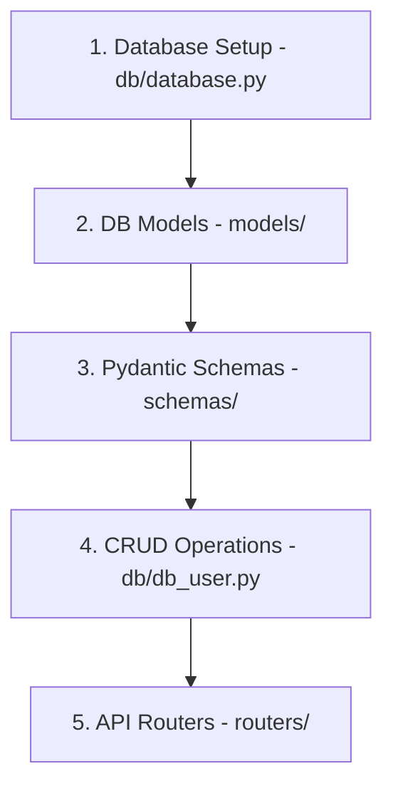

# 🚀 FastAPI Learning Journey & Revision Notes

Welcome to your FastAPI learning repository! This document serves as a comprehensive, easy-to-digest guide and cheat sheet for all the core FastAPI concepts you've practiced in this project.

---

## 📌 Table of Contents
1. [Project Setup & Running the App](#-project-setup--running-the-app)
2. [Application & Router Setup](#-1-application--router-setup)
3. [Path Parameters & Validation](#-2-path-parameters--validation)
4. [Query Parameters](#-3-query-parameters)
5. [Request Body & Pydantic Models](#-4-request-body--pydantic-models)
6. [Response Customization & Status Codes](#-5-response-customization--status-codes)
7. [Database Integration (SQLAlchemy ORM)](#-6-database-integration-sqlalchemy-orm)
8. [Security & Password Hashing](#-7-security--password-hashing)
9. [Complete CRUD & Auth Reference](#-8-complete-crud--auth-reference)

---

## 🛠 Project Setup & Running the App

Since this project is configured with `uv` and has a local virtual environment (`.venv`), you should always run the server using one of the following methods to ensure all dependencies (like `fastapi`, `uvicorn`, `sqlalchemy`, and `passlib`) are loaded correctly.

### Method 1: Using `uv run` (Recommended)
```bash
uv run uvicorn main:app --reload
```

### Method 2: Activating the Virtual Environment
```bash
source .venv/bin/activate
uvicorn main:app --reload
```

---

## 🧩 1. Application & Router Setup

Instead of putting all routes in a single `main.py` file, FastAPI allows you to modularize your code using **`APIRouter`**. This keeps your codebase clean and scalable.

### 📝 Key Concepts
*   **`FastAPI()`**: The core application class that binds everything.
*   **`APIRouter()`**: A mini-application class to group related routes (e.g., users, products).
*   **`prefix`**: Automatically prepends a path to all routes in the router.
*   **`tags`**: Categorizes routes in the auto-generated Swagger UI documentation (`/docs`).

---

## 🛣 2. Path Parameters & Validation

Path parameters are dynamic parts of the URL. They are defined using curly braces `{}` in the route decorator and must match the function argument names.

### 📝 Key Concepts
*   **Type Hinting**: FastAPI automatically parses and validates the type (e.g., `userName: str`, `product_id: int`).
*   **Enum Validation**: Restricts path parameter values to a specific set using Python's `Enum`.
*   **`Path` Validation & Metadata**: You can use `Path` from `fastapi` to add metadata (like `title` and `description`) and numeric validation constraints:
    *   `gt`: Greater than
    *   `ge`: Greater than or equal to (e.g., `ge=1`)
    *   `lt`: Less than
    *   `le`: Less than or equal to (e.g., `le=5`)

---

## 🔍 3. Query Parameters

Query parameters are key-value pairs that appear after the `?` in the URL (e.g., `/products?page=2&category=electronics`). Any function arguments that are **not** part of the path path parameters are automatically treated as query parameters.

---

## 📦 4. Request Body & Pydantic Models

To receive JSON data from the client, you use **Pydantic** models. Pydantic validates the structure and types of the incoming JSON.

---

## 🚦 5. Response Customization & Status Codes

You can dynamically set HTTP status codes (like `200 OK`, `201 Created`, `404 Not Found`) by injecting the `Response` object or utilizing FastAPI's `status` module.

---

## 🗄 6. Database Integration (SQLAlchemy ORM)

Integrating a database using an **Object Relational Mapper (ORM)** like **SQLAlchemy** allows you to interact with database tables using Python classes instead of writing raw SQL queries.

### 🏛 The 4-Layer Architecture
For a clean database architecture, the project is structured into four distinct layers:


---

### 1️⃣ Database Setup & Connection (`db/database.py`)
This file establishes the connection to the SQLite database and provides a session generator.

```python
from sqlalchemy import create_engine
from sqlalchemy.ext.declarative import declarative_base
from sqlalchemy.orm import sessionmaker

# 1. Database URL
SQLALCHEMY_DATABASE_URL = "sqlite:///./blog.db"

# 2. Engine: Establishes connection pool
engine = create_engine(
    SQLALCHEMY_DATABASE_URL, connect_args={"check_same_thread": False}
)

# 3. SessionLocal: Factory for database sessions
SessionLocal = sessionmaker(autocommit=False, autoflush=False, bind=engine)

# 4. Base: Parent class for DB Models
Base = declarative_base()

# 5. Dependency: Yields db session and closes it after request is finished
def get_db():
    db = SessionLocal()
    try:
        yield db
    finally:
        db.close()
```

---

### 2️⃣ Database Models with Relationships (`models/`)
Database models define the structure of your database tables using Python classes. They inherit from `Base`.

#### One-to-Many Relationship (User ↔ Blogs)
A **User** can write many **Blogs**, but a **Blog** belongs to a single **User**.

*   **`ForeignKey`**: Defines the relationship at the database table level (links `user_id` in `blogs` to `id` in `users`).
*   **`relationship`**: Defines a virtual link at the ORM level (allows python to access `user.blogs` or `blog.user` instantly). `back_populates` keeps both sides synchronized.

```python
# models/user.py
from sqlalchemy import Column, Integer, String
from sqlalchemy.orm import relationship
from db.database import Base

class DbUser(Base):
    __tablename__ = 'users'
    id = Column(Integer, primary_key=True, index=True)
    username = Column(String)
    email = Column(String, unique=True)
    password = Column(String)
    
    # Virtual relationship linking to DbBlog
    blogs = relationship("DbBlog", back_populates="user")
```

```python
# models/blog.py
from sqlalchemy import Column, Integer, String, ForeignKey
from sqlalchemy.orm import relationship
from db.database import Base

class DbBlog(Base):
    __tablename__ = 'blogs'
    id = Column(Integer, primary_key=True, index=True)
    title = Column(String)
    content = Column(String)
    
    # Foreign Key pointing to users table
    user_id = Column(Integer, ForeignKey('users.id'))
    
    # Virtual relationship linking back to DbUser
    user = relationship("DbUser", back_populates="blogs")
```

---

### 3️⃣ Pydantic Schemas (`schemas/`)
Pydantic schemas define the data shape for API requests (inputs) and responses (outputs).

> [!IMPORTANT]
> **`orm_mode = True`** (in Pydantic v1) or **`from_attributes = True`** (in Pydantic v2) must be specified in the schema's `Config` class. This allows Pydantic to read data directly from SQLAlchemy ORM objects (e.g., `user.username` or `user.blogs`) rather than expecting a standard dictionary.

```python
# schemas/blog.py
from pydantic import BaseModel

class Blog(BaseModel):
    title: str
    content: str

    class Config:
        orm_mode = True  # Allows Pydantic to parse SQLAlchemy models
```

```python
# schemas/user.py
from typing import List
from pydantic import BaseModel
from schemas.blog import Blog

# Input Schema (When creating a user, we expect password)
class UserBase(BaseModel):
    username: str
    email: str
    password: str

# Output Schema (When returning user data, we exclude password and include their blogs!)
class UserDisplay(BaseModel):
    username: str
    email: str
    blogs: List[Blog] = []  # Nested relation output!

    class Config:
        orm_mode = True
```

---

### 4️⃣ Automatic Table Creation (`main.py`)
To automatically create the database tables when the FastAPI application starts up:

```python
from db.database import engine
from models import user as user_model
from models import blog as blog_model

# Create tables in the database if they do not exist
user_model.Base.metadata.create_all(engine)
blog_model.Base.metadata.create_all(engine)
```

---

## 🔑 7. Security & Password Hashing

For security, you must **never** store passwords as plain text. Instead, hash them using a one-way hashing algorithm like `bcrypt`.

### 📝 Key Concepts
*   **Hashing**: Converting a password into an unreadable string (`hash`) using a salt.
*   **Verification**: Checking if a login password matches the stored hash.

```python
# hash.py
import bcrypt

class Hash:
    @staticmethod
    def bcrypt(password: str) -> str:
        # Encode password string to bytes, generate salt, and hash it
        pwd_bytes = password.encode('utf-8')
        salt = bcrypt.gensalt()
        hashed = bcrypt.hashpw(pwd_bytes, salt)
        return hashed.decode('utf-8')  # Convert back to string to store in DB

    @staticmethod
    def verify_password(password: str, hashed_password: str) -> bool:
        pwd_bytes = password.encode('utf-8')
        hashed_bytes = hashed_password.encode('utf-8')
        return bcrypt.checkpw(pwd_bytes, hashed_bytes)
```

---

## 🔄 8. Complete CRUD & Auth Reference

Here is how to perform all CRUD (Create, Read, Update, Delete) and Authentication operations.

### 1. Create (POST)
To save a new record, instantiate the database model, add it to the session, commit, and refresh to retrieve the auto-generated ID.

*   **CRUD Operation (`db/db_user.py`):**
    ```python
    def create_user(db: Session, request: UserBase):
        new_user = DbUser(
            username=request.username,
            email=request.email,
            password=Hash.bcrypt(request.password)  # Hashed password
        )
        db.add(new_user)
        db.commit()
        db.refresh(new_user)  # Updates new_user with the database-generated ID
        return new_user
    ```
*   **Router (`routers/user.py`):**
    ```python
    @router.post("/", response_model=UserDisplay)
    def create_user(request: UserBase, db: Session = Depends(get_db)):
        return db_user.create_user(db, request)
    ```

### 2. Read All & Read One (GET)
*   **CRUD Operation:**
    ```python
    # Fetch all users
    def get_all_users(db: Session):
        return db.query(DbUser).all()

    # Fetch a single user by ID
    def get_user(db: Session, id: int):
        user = db.query(DbUser).filter(DbUser.id == id).first()
        if not user:
            raise HTTPException(status_code=404, detail="User not found")
        return user
    ```
*   **Router:**
    ```python
    @router.get("/", response_model=List[UserDisplay])
    def get_all_users(db: Session = Depends(get_db)):
        return db_user.get_all_users(db)

    @router.get("/{id}", response_model=UserDisplay)
    def get_user(id: int, db: Session = Depends(get_db)):
        return db_user.get_user(db, id)
    ```

### 3. Update (PUT & PATCH)
*   **`PUT`**: Used for full updates (replaces all fields).
*   **`PATCH`**: Used for partial updates (only updates fields that are provided).

*   **CRUD Operation:**
    ```python
    # Partial Update (PATCH)
    def update_user_partially(db: Session, id: int, request: UserPartial):
        user = db.query(DbUser).filter(DbUser.id == id).first()
        if not user:
            raise HTTPException(status_code=404, detail="User not found")
        
        # Check each field and update if provided
        if request.username is not None:
            user.username = request.username
        if request.email is not None:
            user.email = request.email
        if request.password is not None:
            user.password = Hash.bcrypt(request.password)
            
        db.commit()
        db.refresh(user)
        return user
    ```
*   **Router:**
    ```python
    @router.patch("/{id}", response_model=UserDisplay)
    def update_user_partially(id: int, request: UserPartial, db: Session = Depends(get_db)):
        return db_user.update_user_partially(db, id, request)
    ```

### 4. Delete (DELETE)
*   **CRUD Operation:**
    ```python
    def delete_user(db: Session, id: int):
        user = db.query(DbUser).filter(DbUser.id == id).first()
        if not user:
            raise HTTPException(status_code=404, detail="User not found")
        db.delete(user)
        db.commit()
        return {"message": "User deleted successfully"}
    ```
*   **Router:**
    ```python
    @router.delete("/{id}")
    def delete_user(id: int, db: Session = Depends(get_db)):
        return db_user.delete_user(db, id)
    ```

### 5. Authentication (Login)
*   **CRUD Operation:**
    ```python
    def login_user(db: Session, email: str, password: str):
        user = db.query(DbUser).filter(DbUser.email == email).first()
        if not user:
            raise HTTPException(status_code=404, detail="User not found")
        
        # Verify password
        if not Hash.verify_password(password, user.password):
            raise HTTPException(status_code=401, detail="Invalid password")
            
        return {"username": user.username, "message": "Login successful"}
    ```
*   **Router (`routers/auth.py`):**
    ```python
    @router.post("/login")
    def login(request: Login, db: Session = Depends(get_db)):
        return db_user.login_user(db, request.email, request.password)
    ```

---

## 📖 Quick Reference Cheat Sheet

| Feature | SQLAlchemy Code | Purpose |
| :--- | :--- | :--- |
| **Create Connection** | `create_engine(URL)` | Connects SQLAlchemy to SQLite database. |
| **Generate Session** | `sessionmaker(bind=engine)` | Factory for creating DB sessions. |
| **Dependency Injection** | `db: Session = Depends(get_db)` | Injects DB session into a route. |
| **DB Models Base** | `class DbModel(Base):` | Base class to define database tables. |
| **Pydantic ORM mode** | `orm_mode = True` | Allows Pydantic to read SQLAlchemy models. |
| **Add & Save** | `db.add(obj)`, `db.commit()` | Saves a new record to the database. |
| **Fetch All** | `db.query(Model).all()` | Returns all records from a table. |
| **Filter Records** | `db.query(Model).filter(...)` | Queries records with conditions (like SQL WHERE). |
| **Delete Record** | `db.delete(obj)` | Removes a record from the database. |
| **Relationship** | `relationship("Model", back_populates="...")` | Creates virtual links between tables. |
| **Password Hash** | `bcrypt.hashpw(...)` | Hashes passwords securely. |

---

*Keep this notes file updated as you learn more advanced database concepts like Migrations (Alembic), OAuth2 JWT Authentication, and Async Databases!* 😄
