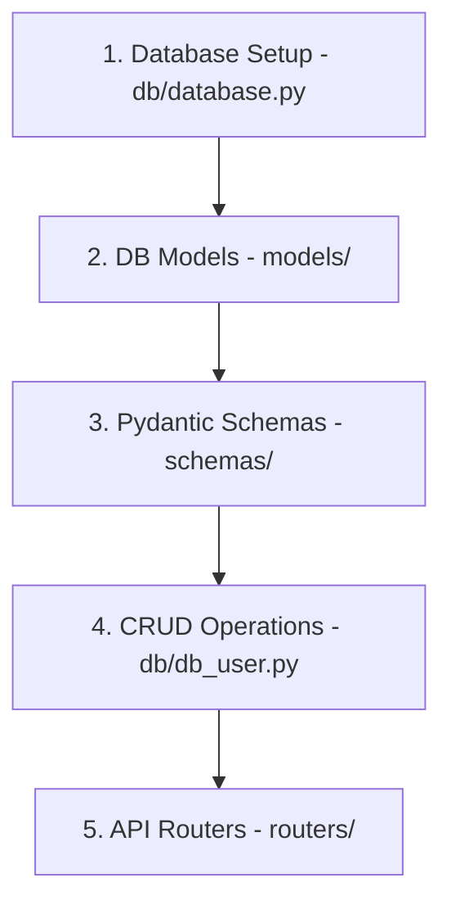
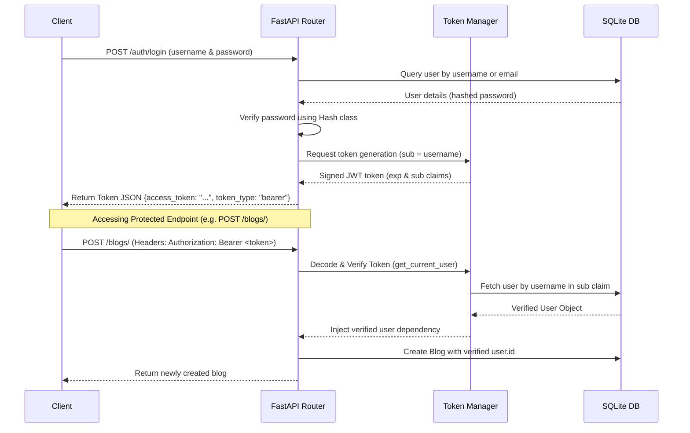

# 🚀 FastAPI Learning Journey & Revision Notes

Welcome to your FastAPI learning repository! This document serves as a comprehensive, easy-to-digest guide and cheat sheet for all the core FastAPI concepts you've practiced in this project.

---

## 📌 Table of Contents
1. [Project Setup & Running the App](#-project-setup--running-the-app)
2. [Application & Router Setup](#-1-application--router-setup)
3. [Path Parameters & Validation](#-2-path-parameters--validation)
4. [Query Parameters](#-3-query-parameters)
5. [Request Body & Pydantic Models](#-4-request-body--pydantic-models)
6. [Form Data & File Uploads](#-5-form-data--file-uploads)
7. [HTTP Headers (Request & Response)](#-6-http-headers-request--response)
8. [CORS (Cross-Origin Resource Sharing)](#-7-cors-cross-origin-resource-sharing)
9. [Database Integration (SQLAlchemy ORM)](#-8-database-integration-sqlalchemy-orm)
10. [Security & Password Hashing](#-9-security--password-hashing)
11. [JWT (JSON Web Token) Authentication](#-10-jwt-json-web-token-authentication)
12. [Complete CRUD & Auth Reference](#-11-complete-crud--auth-reference)

---

## 🛠 Project Setup & Running the App

Since this project is configured with `uv` and has a local virtual environment (`.venv`), you should always run the server using one of the following methods to ensure all dependencies are loaded correctly.

### Method 1: Using `uv run` (Recommended)
```bash
uv run uvicorn main:app --reload
```

### Method 3: Packages Needed for Security & Uploads
To install new dependencies like file upload processors and token signing utilities:
```bash
uv pip install python-multipart python-jose
# Or using standard pip:
pip install python-multipart python-jose[cryptography]
```

---

## 🧩 1. Application & Router Setup

Instead of putting all routes in a single `main.py` file, FastAPI allows you to modularize your code using **`APIRouter`**. This keeps your codebase clean and scalable.

*   **`FastAPI()`**: The core application class that binds everything.
*   **`APIRouter()`**: A mini-application class to group related routes (e.g., users, products).
*   **`prefix`**: Automatically prepends a path to all routes in the router.
*   **`tags`**: Categorizes routes in the auto-generated Swagger UI documentation (`/docs`).

---

## 🛣 2. Path Parameters & Validation

Path parameters are dynamic parts of the URL. They are defined using curly braces `{}` in the route decorator and must match the function argument names.

*   **Type Hinting**: FastAPI automatically parses and validates the type (e.g., `userName: str`, `product_id: int`).
*   **Enum Validation**: Restricts path parameter values to a specific set using Python's `Enum`.
*   **`Path` Validation & Metadata**: You can use `Path` from `fastapi` to add metadata (like `title` and `description`) and numeric validation constraints:
    *   `gt`: Greater than
    *   `ge`: Greater than or equal to (e.g., `ge=1`)
    *   `lt`: Less than
    *   `le`: Less than or equal to (e.g., `le=5`)

---

## 🔍 3. Query Parameters

Query parameters are key-value pairs that appear after the `?` in the URL (e.g., `/products?page=2&category=electronics`). Any function arguments that are **not** part of the path path parameters are automatically treated as query parameters.

---

## 📦 4. Request Body & Pydantic Models

To receive JSON data from the client, you use **Pydantic** models. Pydantic validates the structure and types of the incoming JSON.

---

## 📥 5. Form Data & File Uploads

FastAPI allows receiving Form fields instead of JSON, which is crucial for handling file uploads or standard HTML form submissions.

> [!IMPORTANT]
> To receive uploaded files or form fields, you **must** install `python-multipart`.

### 📝 Key Concepts
*   **`Form`**: Declares that the input parameter should be read from the HTML form data rather than JSON.
*   **`File`**: Declares a file parameter.
*   **`UploadFile`**: A wrapper that has advantages over standard `bytes` (it stores files in memory up to a limit, then writes them to disk to avoid hogging RAM, and provides metadata like `filename` and `content_type`).

### 💻 Code Example

```python
from typing import Optional
from fastapi import APIRouter, Form, File, UploadFile

router = APIRouter(prefix="/products", tags=["product"])

@router.post("/create")
def create_product(
    name: str = Form(...),                      # Form field
    brand_name: str = Form(...),                # Form field
    price: Optional[float] = Form(...),         # Optional Form field
    image: UploadFile = File(...)               # Uploaded file
):
    return {
        "name": name,
        "brand_name": brand_name,
        "price": price,
        "image": image.filename,                # Retrieves filename of the uploaded file
        "message": "Product created successfully",
    }
```

---

## 🌐 6. HTTP Headers (Request & Response)

HTTP headers are used to pass metadata between the client and server.

### 📝 Key Concepts
*   **`Header`**: Declares a header parameter. FastAPI automatically maps snake_case variable names (like `custom_header`) to kebab-case HTTP headers (like `Custom-Header` or `custom-header`).
*   **`Response`**: Injecting `response: Response` lets you add custom headers dynamically to the HTTP response before sending it.

### 💻 Code Example

#### Reading Request Headers
```python
from typing import Optional, List
from fastapi import Header

@router.get("/header")
def get_header(custom_header: Optional[List[str]] = Header(None)):
    # Accepts multiple values for the 'Custom-Header' HTTP header
    return custom_header
```

#### Writing Response Headers
```python
from fastapi import Response

@router.get("/response-header")
def get_response_header(response: Response):
    response.headers["Toke"] = "sample-token"  # Set custom header
    return {"message": "Header added"}
```

---

## 🛡 7. CORS (Cross-Origin Resource Sharing)

If your frontend (e.g., React, Next.js) is hosted on a different domain or port than your FastAPI backend, the browser will block requests unless **CORS Middleware** is enabled.

### 💻 Code Example in `main.py`
```python
from fastapi import FastAPI
from fastapi.middleware.cors import CORSMiddleware

app = FastAPI()

app.add_middleware(
    CORSMiddleware,
    allow_origins=["*"],            # Allows all domains (use specific domains like ['https://myfrontend.com'] in production)
    allow_credentials=True,
    allow_methods=["*"],            # Allows all HTTP methods (GET, POST, etc.)
    allow_headers=["*"],            # Allows all HTTP headers
)
```

---

## 🗄 8. Database Integration (SQLAlchemy ORM)

Integrating a database using an **Object Relational Mapper (ORM)** like **SQLAlchemy** allows you to interact with database tables using Python classes instead of writing raw SQL queries.

### 🏛 The 4-Layer Architecture
For a clean database architecture, the project is structured into four distinct layers:


---

### 1️⃣ Database Setup & Connection (`db/database.py`)
This file establishes the connection to the SQLite database and provides a session generator.

```python
from sqlalchemy import create_engine
from sqlalchemy.ext.declarative import declarative_base
from sqlalchemy.orm import sessionmaker

# 1. Database URL
SQLALCHEMY_DATABASE_URL = "sqlite:///./blog.db"

# 2. Engine: Establishes connection pool
engine = create_engine(
    SQLALCHEMY_DATABASE_URL, connect_args={"check_same_thread": False}
)

# 3. SessionLocal: Factory for database sessions
SessionLocal = sessionmaker(autocommit=False, autoflush=False, bind=engine)

# 4. Base: Parent class for DB Models
Base = declarative_base()

# 5. Dependency: Yields db session and closes it after request is finished
def get_db():
    db = SessionLocal()
    try:
        yield db
    finally:
        db.close()
```

---

### 2️⃣ Database Models with Relationships (`models/`)
Database models define the structure of your database tables using Python classes. They inherit from `Base`.

#### One-to-Many Relationship (User ↔ Blogs)
A **User** can write many **Blogs**, but a **Blog** belongs to a single **User**.

*   **`ForeignKey`**: Defines the relationship at the database table level (links `user_id` in `blogs` to `id` in `users`).
*   **`relationship`**: Defines a virtual link at the ORM level (allows python to access `user.blogs` or `blog.user` instantly). `back_populates` keeps both sides synchronized.

```python
# models/user.py
from sqlalchemy import Column, Integer, String
from sqlalchemy.orm import relationship
from db.database import Base

class DbUser(Base):
    __tablename__ = 'users'
    id = Column(Integer, primary_key=True, index=True)
    username = Column(String)
    email = Column(String, unique=True)
    password = Column(String)
    
    # Virtual relationship linking to DbBlog
    blogs = relationship("DbBlog", back_populates="user")
```

```python
# models/blog.py
from sqlalchemy import Column, Integer, String, ForeignKey
from sqlalchemy.orm import relationship
from db.database import Base

class DbBlog(Base):
    __tablename__ = 'blogs'
    id = Column(Integer, primary_key=True, index=True)
    title = Column(String)
    content = Column(String)
    
    # Foreign Key pointing to users table
    user_id = Column(Integer, ForeignKey('users.id'))
    
    # Virtual relationship linking back to DbUser
    user = relationship("DbUser", back_populates="blogs")
```

---

### 3️⃣ Pydantic Schemas (`schemas/`)
Pydantic schemas define the data shape for API requests (inputs) and responses (outputs).

> [!IMPORTANT]
> **`orm_mode = True`** (in Pydantic v1) or **`from_attributes = True`** (in Pydantic v2) must be specified in the schema's `Config` class. This allows Pydantic to read data directly from SQLAlchemy ORM objects (e.g., `user.username` or `user.blogs`) rather than expecting a standard dictionary.

```python
# schemas/blog.py
from pydantic import BaseModel

class Blog(BaseModel):
    title: str
    content: str

    class Config:
        orm_mode = True  # Allows Pydantic to parse SQLAlchemy models
```

```python
# schemas/user.py
from typing import List
from pydantic import BaseModel
from schemas.blog import Blog

# Input Schema (When creating a user, we expect password)
class UserBase(BaseModel):
    username: str
    email: str
    password: str

# Output Schema (When returning user data, we exclude password and include their blogs!)
class UserDisplay(BaseModel):
    username: str
    email: str
    blogs: List[Blog] = []  # Nested relation output!

    class Config:
        orm_mode = True
```

---

### 4️⃣ Automatic Table Creation (`main.py`)
To automatically create the database tables when the FastAPI application starts up:

```python
from db.database import engine
from models import user as user_model
from models import blog as blog_model

# Create tables in the database if they do not exist
user_model.Base.metadata.create_all(engine)
blog_model.Base.metadata.create_all(engine)
```

---

## 🔑 9. Security & Password Hashing

For security, you must **never** store passwords as plain text. Instead, hash them using a one-way hashing algorithm like `bcrypt`.

### 📝 Key Concepts
*   **Hashing**: Converting a password into an unreadable string (`hash`) using a salt.
*   **Verification**: Checking if a login password matches the stored hash.

```python
# hash.py
import bcrypt

class Hash:
    @staticmethod
    def bcrypt(password: str) -> str:
        # Encode password string to bytes, generate salt, and hash it
        pwd_bytes = password.encode('utf-8')
        salt = bcrypt.gensalt()
        hashed = bcrypt.hashpw(pwd_bytes, salt)
        return hashed.decode('utf-8')  # Convert back to string to store in DB

    @staticmethod
    def verify_password(password: str, hashed_password: str) -> bool:
        pwd_bytes = password.encode('utf-8')
        hashed_bytes = hashed_password.encode('utf-8')
        return bcrypt.checkpw(pwd_bytes, hashed_bytes)
```

---

## 🎫 10. JWT (JSON Web Token) Authentication

FastAPI uses **OAuth2** flows for authentication. JSON Web Tokens (JWT) are signed tokens generated by the server and sent to the client upon login. The client stores the token and sends it in the `Authorization: Bearer <token>` header of subsequent API calls to access protected routes.

### 🔄 The Authentication Workflow


---

### 1️⃣ Token Utility & Current User Dependency (`utils/token.py`)
This utility file houses token creation, verification, and dependency injection mechanisms.

```python
from datetime import datetime, timedelta, timezone
from typing import Optional
from jose import jwt, JWTError
from fastapi import Depends, HTTPException, status
from fastapi.security import OAuth2PasswordBearer
from sqlalchemy.orm.session import Session
from db.database import get_db
from models.user import DbUser

# Configurations (Keep secret keys safe in env vars in production!)
JWT_SECRET = "09d25e094faa6ca2556c818166b7a9563b93f7099f6cd2e3cf2add0d0c1b1562"
JWT_ALGORITHM = "HS256"

# 1. OAuth2 Bearer scheme: Reads "Authorization: Bearer <token>" header automatically
# tokenUrl specifies where the client must request the token (the login endpoint)
oauth2_scheme = OAuth2PasswordBearer(tokenUrl="/auth/login")

# 2. Helper to generate a new JWT
def create_token(data: dict, expire_delta: Optional[timedelta] = None):
    to_encode = data.copy()
    expire = datetime.now(timezone.utc) + (expire_delta if expire_delta else timedelta(minutes=15))
    to_encode.update({"exp": expire})
    encoded_jwt = jwt.encode(to_encode, key=JWT_SECRET, algorithm=JWT_ALGORITHM)
    return encoded_jwt

# 3. Dependency: Validates JWT token and returns the current logged-in DB user
def get_current_user(token: str = Depends(oauth2_scheme), db: Session = Depends(get_db)):
    credentials_exception = HTTPException(
        status_code=status.HTTP_401_UNAUTHORIZED,
        detail="Could not validate credentials",
        headers={"WWW-Authenticate": "Bearer"}
    )
    try:
        # Decode the token
        payload = jwt.decode(token, JWT_SECRET, algorithms=[JWT_ALGORITHM])
        username: str = payload.get("sub")
        if not username:
            raise credentials_exception
    except JWTError:
        raise credentials_exception
        
    # Get the user record from the database
    user = db.query(DbUser).filter(DbUser.username == username).first()
    if not user:
        raise credentials_exception
    return user
```

---

### 2️⃣ OAuth2 Specification Login Route (`routers/auth.py`)
To align with the OAuth2 standard, standard clients send login parameters as **Form fields** rather than JSON bodies. FastAPI provides `OAuth2PasswordRequestForm` to handle this.

```python
from fastapi import APIRouter, Depends
from fastapi.security import OAuth2PasswordRequestForm
from sqlalchemy.orm import Session
from db.database import get_db
from db import db_user

router = APIRouter(prefix="/auth", tags=["auth"])

@router.post("/login")
def login(
    request: OAuth2PasswordRequestForm = Depends(),  # Exposes 'username' and 'password' form fields
    db: Session = Depends(get_db)
):
    # Pass request.username and request.password to login business logic
    return db_user.login_user(db, request.username, request.password)
```

**Under the Hood DB Authentication (`db/db_user.py`):**
```python
def login_user(db: Session, username: str, password: str):
    # Lookup by username OR email
    user = db.query(DbUser).filter((DbUser.username == username) | (DbUser.email == username)).first()
    if not user:
        raise HTTPException(status_code=404, detail="User not found")
        
    # Verify hashed password
    if Hash.verify_password(password, user.password):
        # Generate token
        token = create_token(data={"sub": user.username})
        return {
            "access_token": token,
            "token_type": "bearer",
            "userName": user.username,
            "message": "Login Successful"
        }
    else:
        raise HTTPException(status_code=401, detail="Invalid Password")
```

---

### 3️⃣ Protecting Endpoint Routes (`routers/blog.py`)
You protect routes by injecting `Depends(get_current_user)` or `Depends(oauth2_scheme)`.

```python
from fastapi import APIRouter, Depends
from sqlalchemy.orm import Session
from db.database import get_db
from utils.token import get_current_user
from db import db_blog
from schemas.blog import Blog

router = APIRouter(prefix="/blogs", tags=["blogs"])

@router.post("/", response_model=Blog)
def create_blog(
    request: Blog, 
    db: Session = Depends(get_db), 
    current_user: DbUser = Depends(get_current_user)  # Secures the endpoint and returns the DbUser
):
    # We now pass the authenticated user.id from the injected current_user dependency
    return db_blog.create_blog(db, request, current_user.id)
```

---

## 🔄 11. Complete CRUD & Auth Reference

Here is how to perform all CRUD (Create, Read, Update, Delete) and Authentication operations.

### 1. Create (POST)
To save a new record, instantiate the database model, add it to the session, commit, and refresh to retrieve the auto-generated ID.

*   **CRUD Operation (`db/db_user.py`):**
    ```python
    def create_user(db: Session, request: UserBase):
        new_user = DbUser(
            username=request.username,
            email=request.email,
            password=Hash.bcrypt(request.password)  # Hashed password
        )
        db.add(new_user)
        db.commit()
        db.refresh(new_user)  # Updates new_user with the database-generated ID
        return new_user
    ```
*   **Router (`routers/user.py`):**
    ```python
    @router.post("/", response_model=UserDisplay)
    def create_user(request: UserBase, db: Session = Depends(get_db)):
        return db_user.create_user(db, request)
    ```

### 2. Read All & Read One (GET)
*   **CRUD Operation:**
    ```python
    # Fetch all users
    def get_all_users(db: Session):
        return db.query(DbUser).all()

    # Fetch a single user by ID
    def get_user(db: Session, id: int):
        user = db.query(DbUser).filter(DbUser.id == id).first()
        if not user:
            raise HTTPException(status_code=404, detail="User not found")
        return user
    ```
*   **Router:**
    ```python
    @router.get("/", response_model=List[UserDisplay])
    def get_all_users(db: Session = Depends(get_db)):
        return db_user.get_all_users(db)

    @router.get("/{id}", response_model=UserDisplay)
    def get_user(id: int, db: Session = Depends(get_db)):
        return db_user.get_user(db, id)
    ```

### 3. Update (PUT & PATCH)
*   **`PUT`**: Used for full updates (replaces all fields).
*   **`PATCH`**: Used for partial updates (only updates fields that are provided).

*   **CRUD Operation:**
    ```python
    # Partial Update (PATCH)
    def update_user_partially(db: Session, id: int, request: UserPartial):
        user = db.query(DbUser).filter(DbUser.id == id).first()
        if not user:
            raise HTTPException(status_code=404, detail="User not found")
        
        # Check each field and update if provided
        if request.username is not None:
            user.username = request.username
        if request.email is not None:
            user.email = request.email
        if request.password is not None:
            user.password = Hash.bcrypt(request.password)
            
        db.commit()
        db.refresh(user)
        return user
    ```
*   **Router:**
    ```python
    @router.patch("/{id}", response_model=UserDisplay)
    def update_user_partially(id: int, request: UserPartial, db: Session = Depends(get_db)):
        return db_user.update_user_partially(db, id, request)
    ```

### 4. Delete (DELETE)
*   **CRUD Operation:**
    ```python
    def delete_user(db: Session, id: int):
        user = db.query(DbUser).filter(DbUser.id == id).first()
        if not user:
            raise HTTPException(status_code=404, detail="User not found")
        db.delete(user)
        db.commit()
        return {"message": "User deleted successfully"}
    ```
*   **Router:**
    ```python
    @router.delete("/{id}")
    def delete_user(id: int, db: Session = Depends(get_db)):
        return db_user.delete_user(db, id)
    ```

---

## 📖 Quick Reference Cheat Sheet

| Feature | Syntax / Method | Purpose |
| :--- | :--- | :--- |
| **CORS Middleware** | `CORSMiddleware` | Enables cross-origin requests from frontends. |
| **Form Parameter** | `Form(...)` | Parses parameters from standard HTML forms. |
| **File Parameter** | `File(...)` | Extracts raw file uploads from request. |
| **File Class Wrapper** | `UploadFile` | Safe, lazy file buffering and metadata reader. |
| **Request Header** | `Header(None)` | Extracts request headers. Auto-converts name to kebab-case. |
| **Response Header** | `response.headers["Name"]` | Appends custom headers to API response. |
| **OAuth2 Security** | `OAuth2PasswordBearer(tokenUrl)` | Extracts and authenticates Bearer tokens. |
| **OAuth2 Form** | `OAuth2PasswordRequestForm` | Expects `username` and `password` as Form inputs. |
| **Create JWT** | `jwt.encode(payload, secret, algo)` | Generates and signs JWT tokens. |
| **Decode JWT** | `jwt.decode(token, secret, algo)` | Decodes, verifies expiration, and checks signature. |
| **Current User Dependency** | `Depends(get_current_user)` | Retrieves and returns the authenticated user object. |

---

*Keep this notes file updated as you learn more advanced database concepts like Migrations (Alembic), OAuth2 scopes, and database optimization!* 😄
